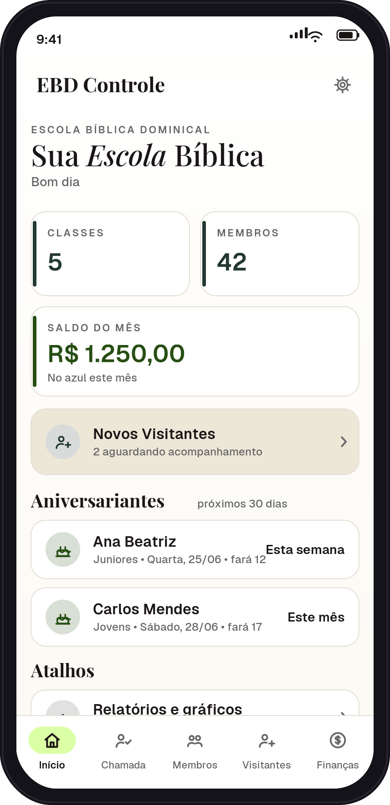
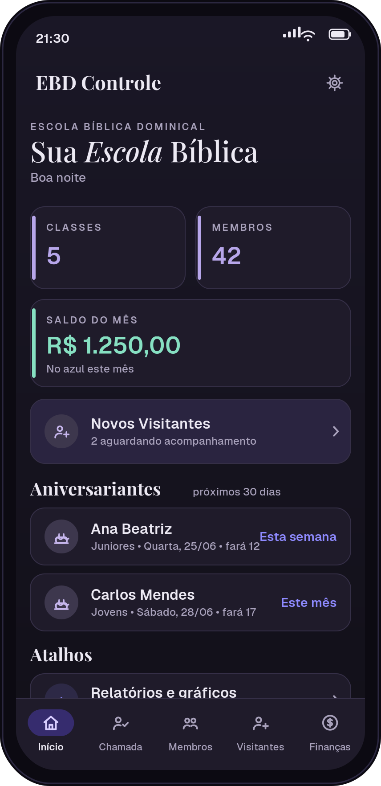
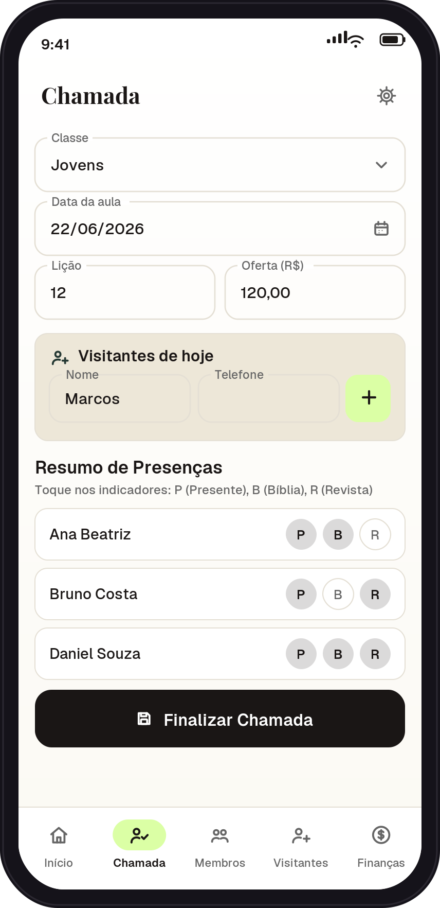
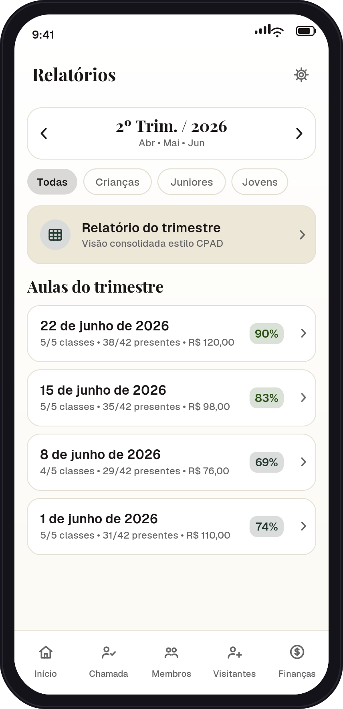
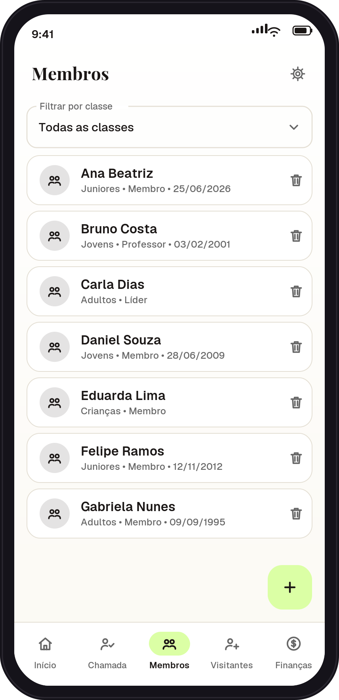

# EBD Controle — App Android

Sistema de gestão da Escola Bíblica Dominical: **classes, membros (com aniversários),
chamada/presença, relatórios com gráficos e finanças**. Funciona **offline** guardando
os dados no próprio celular, com **backup local** (arquivo `.json`) e **sincronização
em nuvem** opcional via Google Sheets + Apps Script.

> App próprio. Não usa marca, textos ou código de terceiros.

---

## Screenshots

Tela inicial nos dois temas — **claro (branco editorial)** e **escuro (tinta-violeta)**:

<table>
  <tr>
    <td align="center">
      <br>
      <sub><b>Início · tema claro</b></sub>
    </td>
    <td align="center">
      <br>
      <sub><b>Início · tema escuro</b></sub>
    </td>
  </tr>
</table>

Chamada/presença, relatórios por trimestre e cadastro de membros:

<table>
  <tr>
    <td align="center">
      <br>
      <sub><b>Chamada</b></sub>
    </td>
    <td align="center">
      <br>
      <sub><b>Relatórios</b></sub>
    </td>
    <td align="center">
      <br>
      <sub><b>Membros</b></sub>
    </td>
  </tr>
</table>

> As imagens acima são **mockups de apresentação** das telas (mesma paleta, tipografia e
> layout do app), guardadas em `docs/screenshots/`. Para usar capturas reais, basta
> substituir os arquivos dessa pasta mantendo os nomes.

---

## 1. Pré-requisitos
- **Android Studio** (versão recente — ex.: Ladybug/Meerkat ou mais novo).
- **JDK 17** (já vem embutido no Android Studio).
- Internet **na primeira abertura** (o Gradle baixa as dependências).

## 2. Abrir o projeto
1. Descompacte o `EBDControle.zip`.
2. No Android Studio: **File → Open** e selecione a pasta `EBDControle`.
3. Aguarde o **Gradle Sync** terminar (alguns minutos na primeira vez).
4. Se aparecer um aviso para **atualizar o AGP/Gradle**, pode aceitar pelo
   **AGP Upgrade Assistant** — o projeto é padrão e atualiza sem problemas.

> **Sobre o `gradle-wrapper.jar`:** não incluído como binário. O Android Studio
> **gera ele sozinho** ao abrir/sincronizar. (Se for compilar por linha de comando
> e ele faltar, rode `gradle wrapper --gradle-version 8.9` ou apenas abra no
> Android Studio.)

## 3. Gerar o APK
- Menu **Build → Build Bundle(s) / APK(s) → Build APK(s)**.
- O APK de teste fica em: `app/build/outputs/apk/debug/app-debug.apk`.
- Para **distribuir de verdade** (mais estável e instalável em qualquer celular),
  gere um **APK assinado**: **Build → Generate Signed Bundle / APK → APK**,
  crie uma *keystore* (guarde-a!) e selecione **release**.

## 4. Instalar nos celulares
1. Envie o arquivo `.apk` (WhatsApp, Drive, cabo etc.).
2. No celular, toque no arquivo e permita **"instalar de fontes desconhecidas"**.
3. Pronto. Cada celular terá seus próprios dados (ou compartilhados, se ativar a nuvem).

## 5. Dados, backup e sincronização

### Backup local (arquivo `.json`)
Tela **Início → Backup e dados**:
- **Exportar** gera um `.json` com TODOS os dados (classes, membros, chamadas,
  visitantes e finanças).
- **Restaurar** lê um `.json` e **substitui** os dados atuais pelos do arquivo
  (pede confirmação antes). Use para recuperar uma cópia ou migrar para outro celular.

### Sincronização em nuvem (Google Sheets)
Permite que **vários celulares** usem os mesmos dados, compartilhando uma planilha:

1. Crie uma planilha no Google e abra **Extensões → Apps Script**.
2. Cole o código do backend (arquivo `appscript/Code.gs` deste repositório) e salve.
3. Rode `RESETAR_E_CONFIGURAR` (uma vez) — cria as abas com cabeçalho correto.
4. **Implantar → Nova implantação → App da Web**:
   - Executar como: *Eu*
   - Quem tem acesso: *Qualquer pessoa*
5. Copie a URL `/exec` e cole em **Configurações → Nuvem e Backup → URL do
   Google Apps Script** dentro do app.
6. Toque em **Sincronizar com Google Sheets**.

> **Como funciona:** o app envia apenas o que mudou; o servidor mescla com a regra
> "última alteração vence" (campo `updatedAt`) e devolve o estado completo. Datas
> aparecem formatadas na planilha (`dd/mm/yyyy`) e nomes de classe/aluno aparecem
> em colunas de apoio ao lado dos IDs, sem afetar a sincronização.

> **Em celular novo:** depois de colar a URL, use **Baixar da nuvem (substituir
> tudo)** para puxar tudo o que já está na planilha.

- O app já vem com as **classes e membros de exemplo** na 1ª execução.

## 6. Aparência (tema claro e escuro)
- Toggle em **Configurações → Aparência → Tema Escuro**.
- **Tema claro — _branco editorial_**: fundo branco quente com um leve degradê
  "papel", cards de borda fina e cantos arredondados, **preto quente (#1A1615)**
  como cor de ação e o **verde-limão** da marca como acento de destaque — usado com
  parcimônia, sempre como preenchimento (pílula da navegação, FAB, "marca-texto").
- **Tema escuro — _tinta-violeta_**: fundo quase-preto com um véu violeta,
  superfícies carvão e um acento **índigo/periwinkle** nos momentos de ação
  (botões e pílula de navegação); um **lilás** sereno e bem legível conduz ícones,
  números e metadados. Sem azul, sem preto frio.
- **Tipografia editorial** em todo o app: manchetes em **Playfair Display**
  (serifa, com itálico realçando uma palavra-chave) e corpo, dados, labels e
  *kickers* em **Geist**.
- Fontes embarcadas no APK (`res/font/`), sob a SIL Open Font License.

## 7. Personalização rápida
- Nome do app: `app/src/main/res/values/strings.xml`.
- Cores e tipografia: `app/src/main/java/com/ebd/controle/ui/theme/Theme.kt`.
- Componentes visuais (cards, gráfico): `ui/components/Components.kt`.
- Layout da tela inicial: `ui/screens/DashboardScreen.kt`.
- Pacote/ID do app: `com.ebd.controle` (em `app/build.gradle.kts`).

## 8. Estrutura do projeto
```
app/src/main/
├── java/com/ebd/controle/
│   ├── MainActivity.kt
│   ├── EBDApp.kt
│   ├── data/                  # Room (banco local), backup, sincronização
│   │   ├── Entities.kt, Daos.kt, AppDatabase.kt
│   │   ├── Repository.kt, Backup.kt, Util.kt
│   │   └── network/SyncService.kt
│   └── ui/
│       ├── ViewModels.kt
│       ├── theme/Theme.kt     # paletas, tipografia, gradientes
│       ├── components/        # StatCard, BarChart, Dropdown, DateField
│       ├── nav/Navigation.kt  # barra inferior + roteamento
│       └── screens/           # 10 telas (Dashboard, Chamada, etc.)
└── res/
    ├── font/                  # Geist + Playfair Display
    └── values/                # strings.xml, themes.xml, colors.xml
```

## 9. Se o Gradle Sync falhar por versão
- Aceite as sugestões de atualização do Android Studio (AGP Upgrade Assistant).
- Versões usadas: Gradle 8.9, AGP 8.7.3, Kotlin 2.0.21, Compose BOM 2024.10.01,
  Room 2.6.1, KSP 2.0.21-1.0.25.
- Caso o Room reclame do KSP, confirme a linha `ksp.useKSP2=false` em
  `gradle.properties` (já incluída), ou atualize o Room para a versão estável
  mais recente da série 2.x.
- **`minSdk` é 26** (Android 8.0+), exigido pelas fontes variáveis do tema.

## 10. Créditos
- **Geist** — Vercel, sob a SIL Open Font License 1.1.
- **Playfair Display** — Claus Eggers Sørensen, sob a SIL Open Font License 1.1.
- Ícones no estilo Material Symbols (Google), sob a Apache License 2.0.
