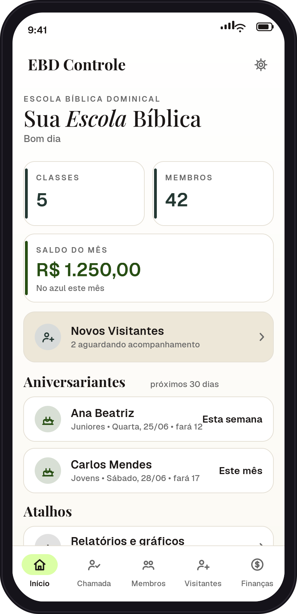
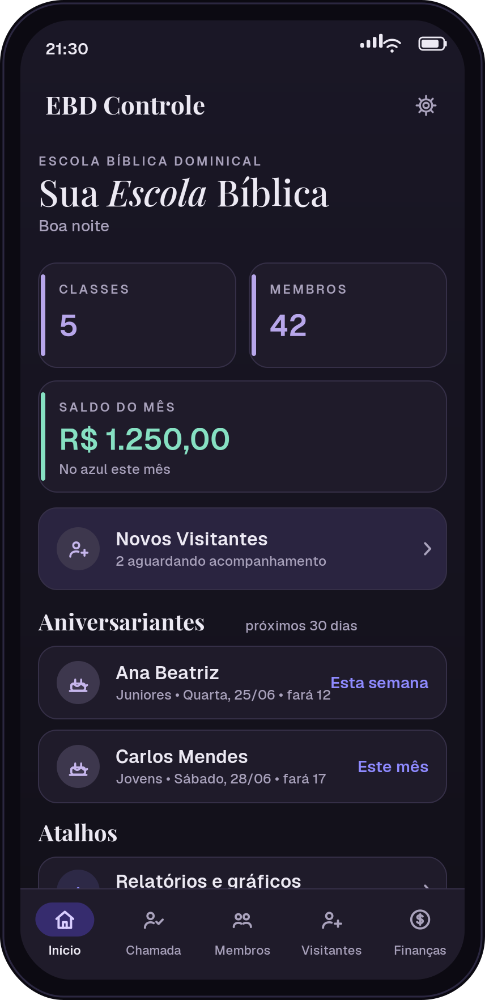
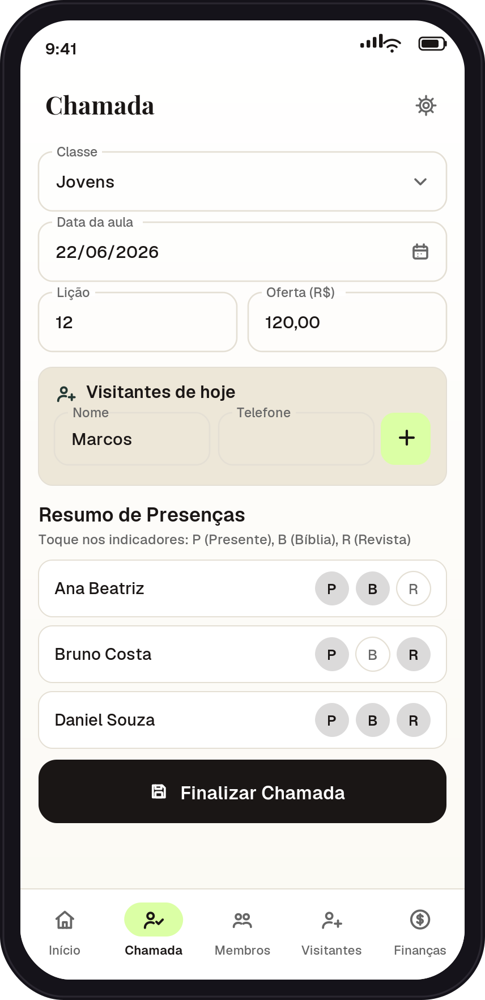
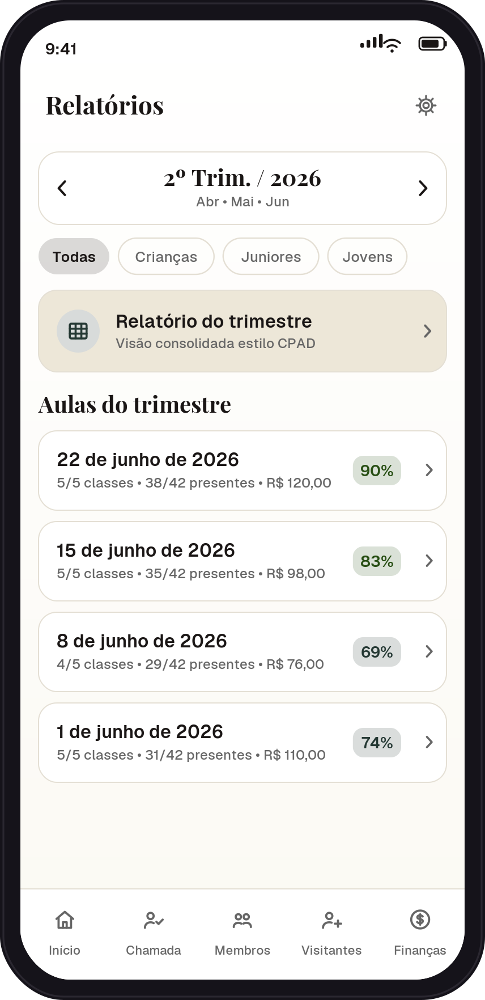
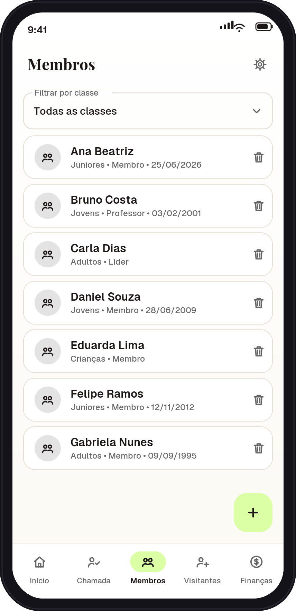
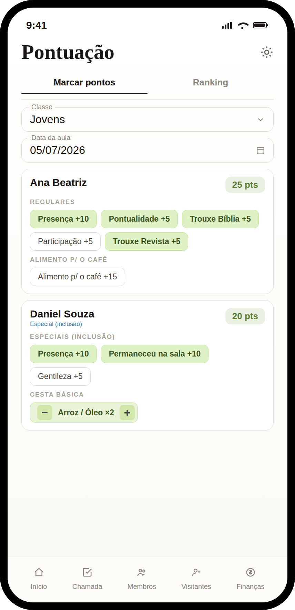
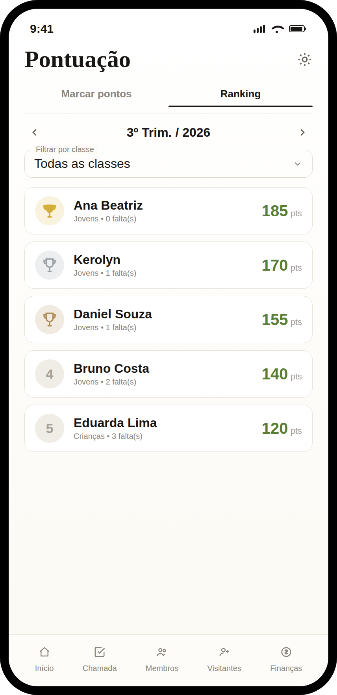

# EBD Controle — App Android

Sistema de gestão da Escola Bíblica Dominical: **classes, membros (com aniversários),
chamada/presença, pontuação e ranking dos alunos, relatórios com gráficos e finanças**.
Funciona **offline** guardando os dados no próprio celular, com **backup local**
(arquivo `.json`) e **sincronização em nuvem** opcional via Google Sheets + Apps Script.

> App próprio. Não usa marca, textos ou código de terceiros.

---

## Screenshots

Tela inicial nos dois temas — **claro (branco editorial)** e **escuro (tinta-violeta)**:

<table>
  <tr>
    <td align="center">
      <br>
      <sub><b>Início · tema claro</b></sub>
    </td>
    <td align="center">
      <br>
      <sub><b>Início · tema escuro</b></sub>
    </td>
  </tr>
</table>

Chamada/presença, relatórios por trimestre e cadastro de membros:

<table>
  <tr>
    <td align="center">
      <br>
      <sub><b>Chamada</b></sub>
    </td>
    <td align="center">
      <br>
      <sub><b>Relatórios</b></sub>
    </td>
    <td align="center">
      <br>
      <sub><b>Membros</b></sub>
    </td>
  </tr>
</table>

Pontuação (marcação rápida) e ranking dos alunos por trimestre:

<table>
  <tr>
    <td align="center">
      <br>
      <sub><b>Pontuação · marcar pontos</b></sub>
    </td>
    <td align="center">
      <br>
      <sub><b>Ranking · pódio do trimestre</b></sub>
    </td>
  </tr>
</table>

> As imagens acima são **mockups de apresentação** das telas (mesma paleta, tipografia e
> layout do app), guardadas em `docs/screenshots/`. Para usar capturas reais, basta
> substituir os arquivos dessa pasta mantendo os nomes.

---

## 1. Pré-requisitos
- **Android Studio** (versão recente — ex.: Ladybug/Meerkat ou mais novo).
- **JDK 17** (já vem embutido no Android Studio).
- Internet **na primeira abertura** (o Gradle baixa as dependências).

## 2. Abrir o projeto
1. Descompacte o `EBDControle.zip`.
2. No Android Studio: **File → Open** e selecione a pasta `EBDControle`.
3. Aguarde o **Gradle Sync** terminar (alguns minutos na primeira vez).
4. Se aparecer um aviso para **atualizar o AGP/Gradle**, pode aceitar pelo
   **AGP Upgrade Assistant** — o projeto é padrão e atualiza sem problemas.

> **Sobre o `gradle-wrapper.jar`:** não incluído como binário. O Android Studio
> **gera ele sozinho** ao abrir/sincronizar. (Se for compilar por linha de comando
> e ele faltar, rode `gradle wrapper --gradle-version 8.9` ou apenas abra no
> Android Studio.)

## 3. Gerar o APK
- Menu **Build → Build Bundle(s) / APK(s) → Build APK(s)**.
- O APK de teste fica em: `app/build/outputs/apk/debug/app-debug.apk`.
- Para **distribuir de verdade** (mais estável e instalável em qualquer celular),
  gere um **APK assinado**: **Build → Generate Signed Bundle / APK → APK**,
  crie uma *keystore* (guarde-a!) e selecione **release**.

## 4. Instalar nos celulares
1. Envie o arquivo `.apk` (WhatsApp, Drive, cabo etc.).
2. No celular, toque no arquivo e permita **"instalar de fontes desconhecidas"**.
3. Pronto. Cada celular terá seus próprios dados (ou compartilhados, se ativar a nuvem).

## 5. Dados, backup e sincronização

### Backup local (arquivo `.json`)
Tela **Início → Backup e dados**:
- **Exportar** gera um `.json` com TODOS os dados — as 10 tabelas: classes, membros,
  chamadas, presenças, visitantes, finanças, preços e entregas de revistas, critérios
  de pontuação e pontos lançados.
- **Restaurar** lê um `.json` e **substitui** os dados atuais pelos do arquivo
  (pede confirmação antes). Use para recuperar uma cópia ou migrar para outro celular.

> O arquivo guarda também a identidade de sincronização de cada registro (`uid` e
> `updatedAt`). É o que permite restaurar num aparelho que usa a nuvem sem duplicar
> a planilha inteira. Formato na **versão 3**; o app recusa arquivo de versão mais
> nova que a que ele entende, e recusa também um despejo da sincronização escolhido
> por engano — a restauração apaga o banco, então tudo o que dá para conferir é
> conferido antes.

### Sincronização em nuvem (Google Sheets)
Permite que **vários celulares** usem os mesmos dados, compartilhando uma planilha:

1. Crie uma planilha no Google e abra **Extensões → Apps Script**.
2. Cole o código do backend ([`appscript/Code.gs`](appscript/Code.gs)) e salve.
3. Rode `RESETAR_E_CONFIGURAR` (uma vez) — cria as abas com cabeçalho correto.
4. **Implantar → Nova implantação → App da Web**:
   - Executar como: *Eu*
   - Quem tem acesso: *Qualquer pessoa*
5. Copie a URL `/exec` e cole em **Configurações → Nuvem e Backup → URL do
   Google Apps Script** dentro do app.
6. Toque em **Sincronizar com Google Sheets**.

> **Como funciona:** o app envia o que tem; o servidor mescla por `uid` com a regra
> "última alteração vence" (`updatedAt`) e devolve o estado completo. Nomes de classe
> e aluno aparecem em colunas de apoio ao lado dos IDs, sem afetar a sincronização.

> **Abas da planilha:** `classes`, `alunos`, `chamadas`, `presencas`, `financeiro`,
> `revistasPrecos`, `revistasEntregas`, `criterios`, `pontos` e `visitantes`.

> **Em celular novo:** depois de colar a URL, use **Baixar da nuvem (substituir
> tudo)** para puxar tudo o que já está na planilha. Instalação limpa nasce sem
> classes e sem membros — os critérios de pontuação padrão, esses sim, já vêm.

#### Atualizando de uma planilha na v1 do script

Se a planilha foi criada antes de agosto/2026, rode **`MIGRAR_PARA_V2`** uma vez.
Ele converte `updatedAt` de célula de data para número, cria a coluna de dízimos e
repara a formatação das colunas booleanas. Não apaga dado.

**A ordem importa:** cole o código → **reimplante** (Nova versão) → só então rode a
migração. Quem atende o `/exec` é a versão implantada; migrar antes de reimplantar
faz a primeira sincronização desfazer o trabalho. Faça uma cópia da planilha antes.

> **Fuso horário da planilha:** confira em **Arquivo → Configurações** que está em
> `(GMT-03:00) São Paulo`. Fuso divergente desloca datas em um dia no ida-e-volta.

## 6. Pontuação e ranking dos alunos

Tela **Início → Pontuação e ranking dos alunos** (também acessível pelo atalho 🏆
no Dashboard). Feita para marcar pontos **rápido** durante a aula e acompanhar a
disputa por trimestre.

### Aba "Marcar pontos"
- Escolha a **classe** e a **data**; cada aluno aparece com botões de toque rápido.
- Critérios de **toque único** (presença, pontualidade, participação, visitante):
  um toque marca/desmarca.
- Critérios **por quantidade** (alimentos por unidade/peso): botão **− / +** para
  contar unidades; os pontos são multiplicados automaticamente.
- O **total do aluno no dia** atualiza na hora.
- Alunos marcados como **especiais (inclusão)** veem automaticamente o grupo de
  metas adaptadas.

### Aba "Ranking"
- **Pódio do trimestre** (ouro/prata/bronze), com filtro por classe.
- **Desempate por menos faltas** (contadas a partir das chamadas registradas).

### Critérios (o que vale ponto)
- Botão **Critérios** abre o catálogo editável — crie, edite valores e exclua.
- Organizados em grupos: **Regulares**, **Especiais (inclusão)**,
  **Alimento p/ o café** (pontuação fixa) e **Cesta básica** (tabelada por item).
- O app já vem com um conjunto padrão de critérios; tudo é ajustável pela tela e
  sincroniza pela nuvem (abas `criterios` e `pontos`).

> **Aluno especial:** marque no cadastro em **Membros → editar aluno →
> "Aluno especial (inclusão)"**. Isso troca o grupo de critérios exibido para ele
> na marcação.

## 7. Mural público do ranking (GitHub Pages)

O ranking pode ir ao ar numa página que qualquer pessoa acessa, sem backend e sem custo.

Quem calcula o ranking é o próprio Apps Script, pelo endpoint
`?ranking=1&ano=&trimestre=`. Um workflow do GitHub Actions
([`.github/workflows/publicar-ranking.yml`](.github/workflows/publicar-ranking.yml))
busca os quatro trimestres, grava os JSONs ao lado de [`site/index.html`](site/index.html)
e publica tudo no Pages.

**Configuração (uma vez):**

1. **Settings → Secrets and variables → Actions → New repository secret**
   Nome `EBD_APPS_SCRIPT_URL`, valor: a URL `/exec` da implantação.
2. **Settings → Pages → Source: GitHub Actions**.
3. **Actions → Publicar ranking → Run workflow**, para a primeira publicação.

**Quando atualiza:** domingo, de 8h05 às 12h55, a cada 10 minutos; e todo dia às 18h05.
A própria página confere se há publicação nova a cada minuto, então um mural numa TV
se atualiza sozinho. O cron do GitHub é melhor esforço e costuma atrasar alguns
minutos — conte com uma defasagem real de 10 a 25 minutos.

> **Por que a URL fica num segredo, e não na página:** `doGet` sem parâmetro devolve a
> planilha inteira — telefones e datas de nascimento dos membros inclusive. Publicar a
> URL entregaria tudo isso a quem abrisse o código-fonte. Só o recorte do ranking (nome,
> classe, pontos e faltas) chega ao ar.

> Para pôr os logotipos, coloque `logo-igreja.png` e `logo-ebd.png` dentro de `site/`.
> O workflow copia, e a página os esconde sozinha se não existirem.

## 8. Aparência (tema claro e escuro)
- Toggle em **Configurações → Aparência → Tema Escuro**.
- **Tema claro — _branco editorial_**: fundo branco quente com um leve degradê
  "papel", cards de borda fina e cantos arredondados, **preto quente (#1A1615)**
  como cor de ação e o **verde-limão** da marca como acento de destaque — usado com
  parcimônia, sempre como preenchimento (pílula da navegação, FAB, "marca-texto").
- **Tema escuro — _tinta-violeta_**: fundo quase-preto com um véu violeta,
  superfícies carvão e um acento **índigo/periwinkle** nos momentos de ação
  (botões e pílula de navegação); um **lilás** sereno e bem legível conduz ícones,
  números e metadados. Sem azul, sem preto frio.
- **Tipografia editorial** em todo o app: manchetes em **Playfair Display**
  (serifa, com itálico realçando uma palavra-chave) e corpo, dados, labels e
  *kickers* em **Geist**.
- Fontes embarcadas no APK (`res/font/`), sob a SIL Open Font License.

## 9. Personalização rápida
- Nome do app: `app/src/main/res/values/strings.xml`.
- Cores e tipografia: `app/src/main/java/com/ebd/controle/ui/theme/Theme.kt`.
- Componentes visuais (cards, gráfico): `ui/components/Components.kt`.
- Layout da tela inicial: `ui/screens/DashboardScreen.kt`.
- Pacote/ID do app: `com.ebd.controle` (em `app/build.gradle.kts`).

## 10. Estrutura do projeto
```
├── app/src/main/
│   ├── java/com/ebd/controle/
│   │   ├── MainActivity.kt
│   │   ├── EBDApp.kt
│   │   ├── data/                  # Room (banco local), backup, sincronização
│   │   │   ├── Entities.kt, Daos.kt, AppDatabase.kt
│   │   │   ├── Repository.kt, Backup.kt, Util.kt
│   │   │   └── network/SyncEngine.kt
│   │   └── ui/
│   │       ├── ViewModels.kt
│   │       ├── theme/Theme.kt     # paletas, tipografia, gradientes
│   │       ├── components/        # StatCard, BarChart, Dropdown, DateField
│   │       ├── nav/Navigation.kt  # barra inferior + roteamento
│   │       └── screens/           # 11 telas (Dashboard, Chamada, Pontuação, etc.)
│   └── res/
│       ├── font/                  # Geist + Playfair Display
│       └── values/                # strings.xml, themes.xml, colors.xml
├── appscript/Code.gs              # backend da sincronização (Google Apps Script)
├── site/index.html                # mural público do ranking (GitHub Pages)
├── ranking-impressao.html         # mural para uso interno, com a URL colada à mão
└── docs/ANALISE.md                # diagnóstico técnico e ordem de trabalho
```

> **Banco de dados (Room):** versão atual **8**. A migração 7→8 adiciona as tabelas
> `criterios_pontuacao` e `pontos_lancamentos` e a coluna `especial` em `alunos`,
> sem apagar dados. Roda sozinha na primeira abertura do app após a atualização.
> Em instalação limpa não há migração — o esquema nasce na versão atual e um
> `onCreate` semeia os critérios padrão.

> **Estado do código:** [`docs/ANALISE.md`](docs/ANALISE.md) documenta os defeitos de
> integridade de dados encontrados em agosto/2026, o que já foi corrigido e o que
> continua em aberto. Vale a leitura antes de mexer na camada de sincronização.

## 11. Se o Gradle Sync falhar por versão
- Aceite as sugestões de atualização do Android Studio (AGP Upgrade Assistant).
- Versões usadas: Gradle 8.9, AGP 8.7.3, Kotlin 2.0.21, Compose BOM 2024.10.01,
  Room 2.6.1, KSP 2.0.21-1.0.25.
- Caso o Room reclame do KSP, confirme a linha `ksp.useKSP2=false` em
  `gradle.properties` (já incluída), ou atualize o Room para a versão estável
  mais recente da série 2.x.
- **`minSdk` é 26** (Android 8.0+), exigido pelas fontes variáveis do tema.

## 12. Créditos
- **Geist** — Vercel, sob a SIL Open Font License 1.1.
- **Playfair Display** — Claus Eggers Sørensen, sob a SIL Open Font License 1.1.
- Ícones no estilo Material Symbols (Google), sob a Apache License 2.0.
